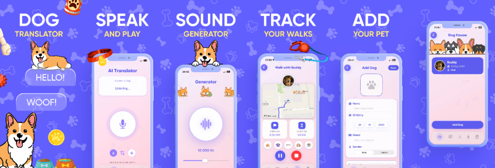
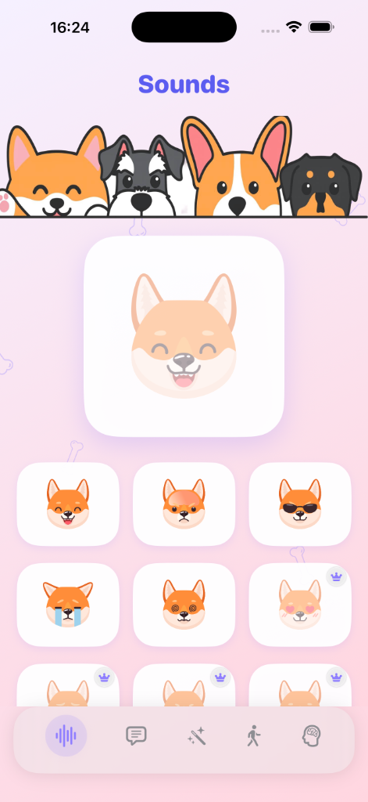
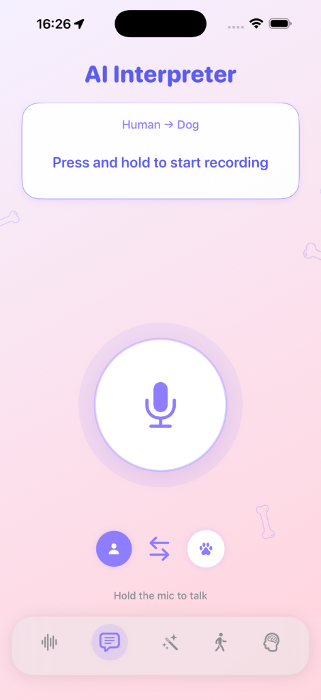
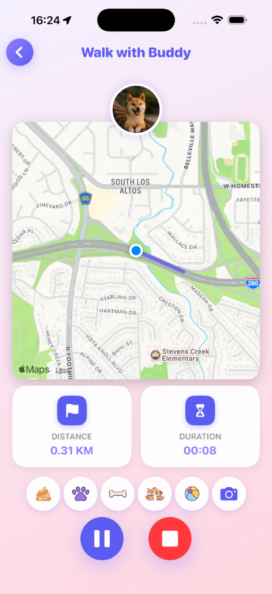
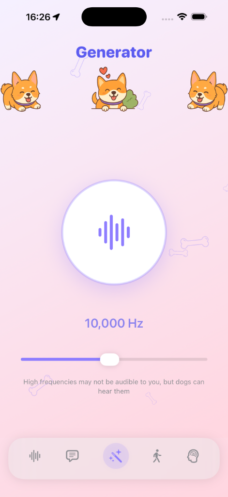
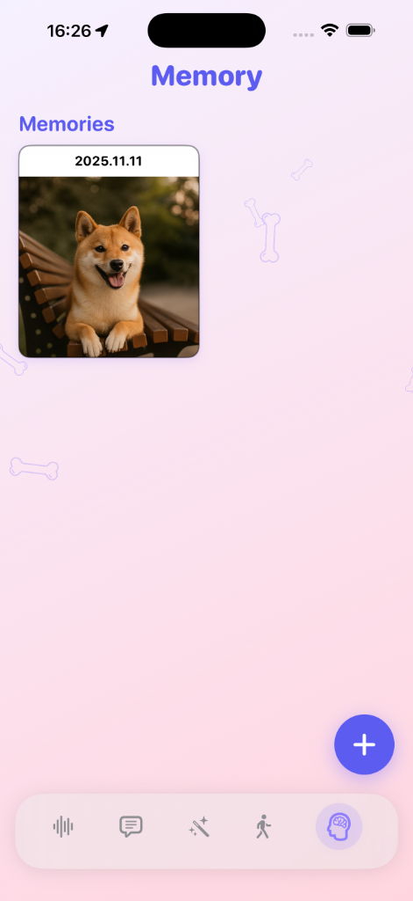

# 🐾 AI Dog Translator & Walk
<a id="english"></a>

<div align="center">



[](https://developer.apple.com/ios/)
[](https://swift.org)
[](https://developer.apple.com/xcode/swiftui/)
[](https://developer.apple.com/xcode/)

[](https://developer.apple.com/documentation/activitykit)
[](https://developer.apple.com/documentation/mapkit)
[](https://developer.apple.com/documentation/avfoundation)
[](https://en.wikipedia.org/wiki/Model%E2%80%93view%E2%80%93viewmodel)
[](LICENSE)

<br>

**[Читать на русском](#russian)**

</div>

---

## 💡 Project Overview

**AI Dog Translator & Walk** is a cutting-edge iOS application that redefines pet interaction. By fusing **Generative AI**, **Signal Processing**, and **Real-time Geolocation**, it offers a comprehensive suite of tools for the modern dog owner.

Built with a relentless focus on **Clean Architecture** and **Scalability**, this project serves as a benchmark for modern iOS development practices, utilizing the full power of the Apple ecosystem.

---

## 📱 Application Showcase

<div align="center">

| **Sounds** | **AI Translator** | **Walk Tracker** |
|:---:|:---:|:---:|
|  |  |  |

| **Whistle Generator** | **Memories** | |
|:---:|:---:|:---:|
|  |  | |

</div>

---

## 🛠 Technical Architecture & Stack

The application is architected using **SwiftUI** and adheres to a strict **MVVM (Model-View-ViewModel)** pattern with a **Service-Oriented** layer. This ensures separation of concerns, testability, and ease of maintenance.

### 🏗 Core Technologies

*   **SwiftUI**: Declarative UI framework for building fluid, responsive interfaces.
*   **Combine**: Reactive framework for handling asynchronous events and data streams.
*   **Concurrency (Async/Await)**: Modern structured concurrency for efficient background tasks.
*   **Core Data / UserDefaults**: Robust data persistence strategies.

### 🧩 Key Frameworks & Modules

| Feature | Frameworks / Tools | Technical Highlight |
| :--- | :--- | :--- |
| **AI Engine** | `URLSession`, `Codable` | Integration with **Anthropic Claude 3 API** for context-aware, humorous translation generation. |
| **Geolocation** | `CoreLocation`, `MapKit` | High-precision GPS tracking, background location updates, and custom map overlays (`MKPolyline`). |
| **Live Activities** | `ActivityKit`, `WidgetKit` | **Dynamic Island** support for iPhone 14 Pro+ and Lock Screen widgets for real-time walk stats. |
| **Audio Processing** | `AVFoundation` | Custom `AVTonePlayerUnit` for generating pure sine waves (10kHz-20kHz) and real-time spectral analysis. |
| **Monetization** | `StoreKit 2` | Modern IAP implementation with `ProductView`, subscription groups, and entitlement verification. |
| **Visuals** | `SpriteKit` | High-performance 2D particle systems (floating bones) integrated seamlessly into SwiftUI views. |

---

## 📂 Project Structure

Reflecting a modular and scalable folder structure:

```text
Dog Translator/
├── App/
│   ├── DogTranslatorApp.swift    # App Entry Point & Dependency Injection
│   └── MainTabView.swift         # Root Navigation Controller
├── Core/
│   ├── Services/                 # Singleton Services (Audio, Location, API)
│   ├── Models/                   # Data Models & Structs
│   ├── Extensions/               # Swift Extensions (Color, View, etc.)
│   └── UI/                       # Reusable UI Components (Buttons, Backgrounds)
├── Features/
│   ├── Translator/               # MVVM for AI Translation
│   ├── Walk/                     # MVVM for Map & Tracking
│   ├── Sounds/                   # MVVM for Audio Grid
│   ├── Generator/                # MVVM for Frequency Oscillator
│   ├── Memories/                 # MVVM for Walk History
│   └── Paywall/                  # StoreKit 2 Presentation
├── DogWalkWidget/                # Widget Extension Target
│   ├── DogWalkWidgetLiveActivity.swift
│   └── DogWalkWidgetBundle.swift
└── Resources/
    └── Assets.xcassets           # App Icon, Colors, Image Sets
```

---

<br>
<br>
<br>

# 🐾 AI Переводчик для Собак & Прогулки
<a id="russian"></a>

<div align="center">

**[Read in English](#english)**

</div>

---

## 💡 Обзор Проекта

**AI Dog Translator & Walk** — это флагманское iOS приложение, объединяющее развлечение и утилиты для владельцев собак. Проект демонстрирует использование передовых технологий: **Generative AI**, **Signal Processing** и **Real-time Geolocation**.

Разработано с применением принципов **Clean Architecture**, что делает кодовую базу масштабируемой, тестируемой и легкой в поддержке.

---

## 🛠 Технический Стек

Приложение построено на **SwiftUI** с использованием паттерна **MVVM** и сервисного слоя.

### 🧩 Ключевые Модули

| Функция | Фреймворки | Описание реализации |
| :--- | :--- | :--- |
| **AI Ядро** | `URLSession`, `Codable` | Интеграция с **Claude 3 API** для генерации "переводов" на основе контекста. |
| **Геолокация** | `CoreLocation`, `MapKit` | Точный GPS-трекинг, фоновое отслеживание, отрисовка маршрутов на карте. |
| **Live Activities** | `ActivityKit`, `WidgetKit` | Поддержка **Dynamic Island** и виджетов экрана блокировки для отображения статистики в реальном времени. |
| **Аудио** | `AVFoundation` | Генерация чистого синусоидального сигнала (ультразвук) и анализ аудио-спектра. |
| **Покупки** | `StoreKit 2` | Современная реализация подписок, восстановление покупок, динамический Paywall. |
| **Графика** | `SpriteKit` | Интеграция систем частиц (SpriteKit) в интерфейс SwiftUI для живых фонов. |

---

## 📂 Структура Проекта

```text
Dog Translator/
├── App/
│   ├── DogTranslatorApp.swift    # Точка входа
│   └── MainTabView.swift         # Навигация
├── Core/                         # Ядро приложения
│   ├── Services/                 # Сервисы (Аудио, Локация, API)
│   ├── Models/                   # Модели данных
│   └── UI/                       # Переиспользуемые компоненты
├── Features/                     # Функциональные модули (MVVM)
│   ├── Translator/               # Переводчик
│   ├── Walk/                     # Прогулки и Карты
│   ├── Sounds/                   # Звуки
│   ├── Generator/                # Генератор частот
│   └── Paywall/                  # Экран покупки
└── DogWalkWidget/                # Виджеты
```
